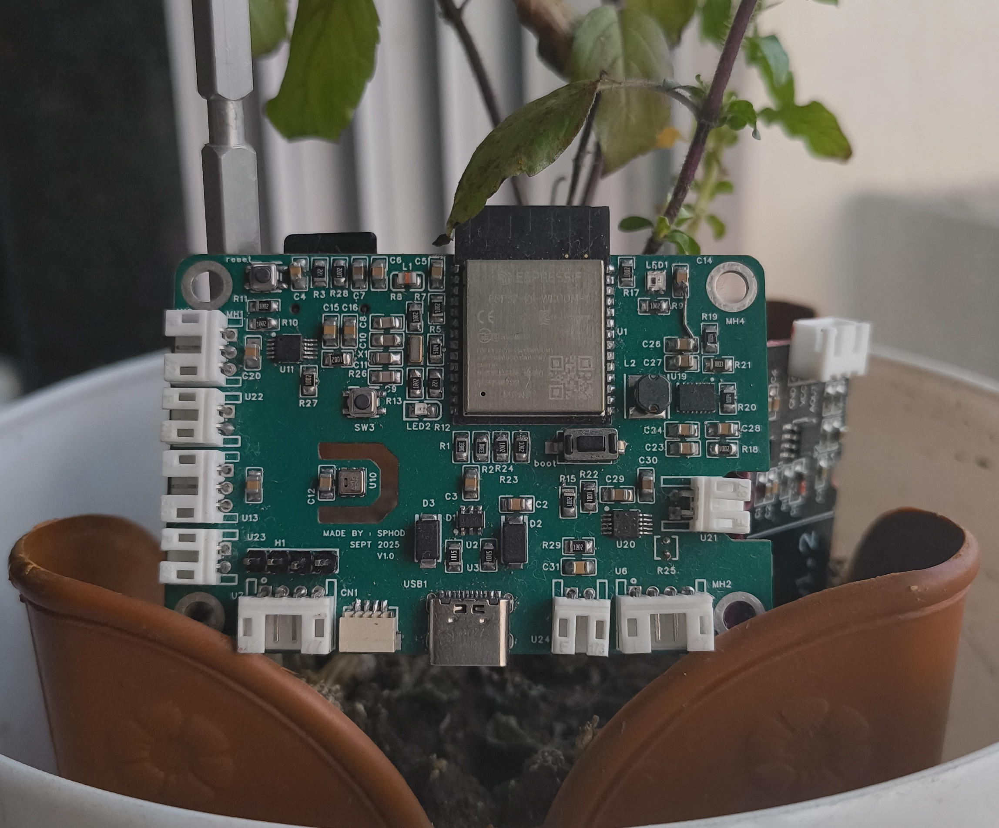

# 🌱 LeafySense

Smart Garden IoT System | ESP32-C6 | OTA Updates | MQTT | Web Portal Monitor your garden's health with real-time soil moisture, temperature, and humidity data. Features automatic GitHub OTA updates, MQTT publishing, captive portal setup, and factory reset with LED indicators.

## 📋 PCB



## 📋 Features

- **🌡️ Multi-Sensor Monitoring**
  - AHT20: Air temperature & humidity
  - ADS1115: Soil moisture & temperature (2 channels)
  - NTC thermistors for soil temperature

- **📡 Wireless Connectivity**
  - WiFi with automatic AP fallback
  - Captive portal for easy configuration
  - mDNS support (`smartgarden.local`)
  - MQTT for data publishing

- **🔄 Advanced Features**
  - **OTA Updates** from GitHub releases
  - Factory reset button with confirmation
  - Web-based configuration interface
  - LED status indicator (WS2812B)
  - Real-time sensor web display

- **🔧 Configuration & Management**
  - Web-based captive portal setup
  - Configurable MQTT settings
  - Device naming and customization
  - Persistent storage using Preferences

## 🛠️ Hardware Requirements

### Components
- ESP32-C6 Development Board
- AHT20 Temperature & Humidity Sensor
- ADS1115 16-bit ADC
- 2x Capacitive Soil Moisture Sensors
- 2x NTC Thermistors (10K, B3950) (Waterproof)
- WS2812B RGB LED
- Reset Button (GPIO 9)
- 10KΩ resistors for NTC voltage divider (SMD)


## 🛠️  Uploading the Code
- Open `LeafySense.ino` in Arduino IDE
- Select ESP32-C6 board
- Select appropriate COM port
- Upload the sketch

## 🛠️ First-Time Setup

### WiFi Configuration
1.  On first boot, the device creates a WiFi AP: `SmartGarden_XXXX`
    
2.  Connect to this network (no password required)
    
3.  Open browser to: `http://192.168.4.1` or `http://setup.smartgarden`
    
4.  Configure:
    
    -   Your WiFi SSID and password
        
    -   Device name
        
    -   MQTT settings (optional)
        
    -   Click "Save & Connect"

 ### Normal Operation
 Once configured:

-   Device connects to your WiFi
    
-   Web interface: `http://smartgarden.local` 
    
-   LED shows status:
    
    -   **Green**: All systems OK
        
    -   **Yellow**: WiFi OK, no MQTT
        
    -   **Red**: No WiFi
        
    -   **Orange**: WiFi & MQTT OK, sensor issues
        
    -   **Cyan Blinking**: Captive portal mode

## 🛠️🔄 OTA Updates

### Automatic Updates
-   Device checks GitHub on startup
    
-   If newer version found, automatically downloads and updates

## 🔧 Factory Reset

### Button Reset Procedure

1.  **Press and hold** reset button (GPIO 9)
    
2.  After 5 seconds: Red LED starts blinking
    
3.  **Press button again** within 10 seconds to confirm
    
4.  Device will:
    
    -   Clear all saved configurations
        
    -   Restart in captive portal mode
        
    -   LED blinks cyan
        
## ⚙️ Configuration Files

### `config.h` - Main Configuration

```
// WiFi
#define WIFI_AP_SSID_PREFIX "SmartGarden_"

// Reset
#define RESET_BUTTON_PIN 9
#define RESET_HOLD_TIME 5000
#define RESET_CONFIRM_TIME 10000

// I2C
#define I2C_SDA_PIN 6
#define I2C_SCL_PIN 7

// Sensors
#define SOIL_MOISTURE_DRY 25000
#define SOIL_MOISTURE_WET 15000

// OTA
#define CURRENT_FIRMWARE_VERSION "1.0.0"
#define UPDATE_CHECK_INTERVAL 300000  // 5 minutes
```


### `config.cpp` - Default Values
```
// NTC Thermistor
const float R_FIXED = 10000.0;
const float BETA = 3950.0;
const float T0 = 298.15;
const float R0 = 10000.0;
const float VCC = 3.3;

// NTP
const char* NTP_SERVER = "pool.ntp.org";
const long GMT_OFFSET_SEC = 5 * 3600 + 30 * 60;  // GMT+5:30
```

## Support
-   Email: saurabhphodkar4869@gmail.com

## License
[MIT](https://choosealicense.com/licenses/mit/)